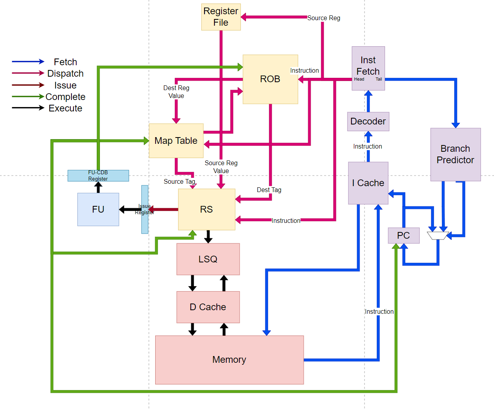
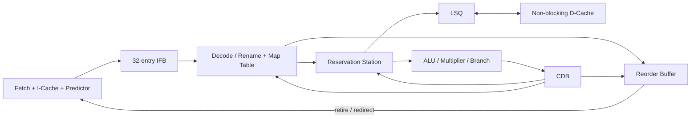
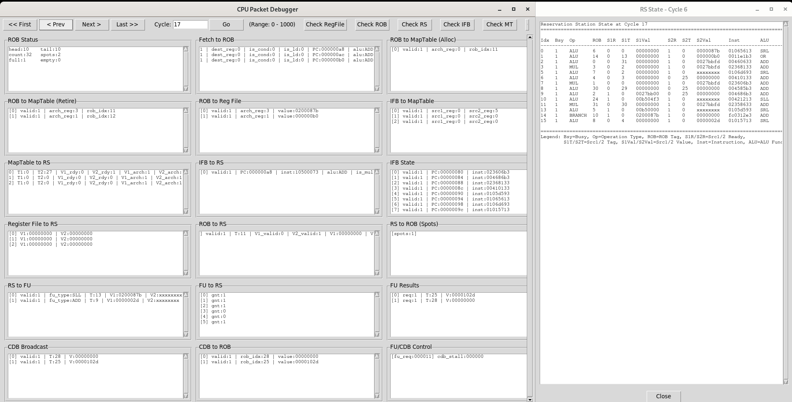

# Three-Way Superscalar Out-of-Order RISC-V Processor

**P6-style microarchitecture · SystemVerilog · University of Michigan EECS 470 (Fall 2025) · Team 12, "OoOps"**

[Interactive demo](./index.html) · [Final report (PDF)](./EECS470_Final_Report.pdf) · Private course repository (source not published)

A three-wide, P6-style out-of-order RISC-V core featuring register renaming, reservation-station scheduling, a reorder buffer, a speculative load/store queue (LSQ), a hybrid branch predictor, instruction prefetching, and separate instruction and non-blocking data caches. The final design passes all correctness tests in the benchmark suite.


## At a glance

| Metric | Value |
|---|---|
| Post-synthesis clock period | **8.3 ns** (down from 11 ns) |
| Weighted-average CPI | **2.129** |
| Hybrid branch-predictor hit rate | **87.2%** (bimodal 84.3%, GShare 85.4%) |
| Issue width | **3-wide** |

## Team

Lingxiao Yang · Rui Jiang · Runshuang Guo · Juntao Wu

| Block | Owner(s) |
|---|---|
| ROB, instruction fetch unit, LSQ, final data cache | Juntao Wu |
| Map table, instruction cache, branch predictor, configuration tuning | Lingxiao Yang |
| Reservation station, initial data cache, cache debugging | Runshuang Guo |
| Functional units, CDB, backend integration and verification | Rui Jiang |

CPI and timing optimization were shared across the team.

## Microarchitecture





### Front end
- Three instructions fetched per cycle from an even/odd-banked, direct-mapped I-cache (32 lines x 8 B) plus a 4-entry victim cache.
- Hybrid predictor: 64-entry bimodal table, 64-entry GShare table (6-bit global history), and a per-lane chooser.
- 64-entry direct-mapped BTB and a 16-entry return-address stack. The committed stack is copied back on recovery.
- 32-entry instruction fetch buffer (IFB) decouples fetch from decode and exposes a "spots" signal for backpressure.
- Sequential multi-block prefetch: up to four outstanding I-cache transactions (PC, PC+8 demand; PC+16, PC+24 prefetch).

### Out-of-order backend
- **Map table:** per-architectural-register producer ROB tag and ready bit. x0 is hardwired to "not renamed". Same-cycle allocation order is low-to-high lane, so the youngest wins. Retirement only clears an entry the retiring instruction still owns.
- **Reservation station:** busy bit, opclass, ROB tag, and two sources with ready/tag/value per entry. CDB wakeup, plus CDB snooping at dispatch to skip a wakeup cycle. Per-class selectors, then a global 3-wide arbitration stage over FU lanes with small issue registers. Early-tag-broadcast wiring is in place but disabled in the final configuration.
- **ROB:** each entry is its own state machine driven by CDB and control inputs. Misprediction comparison happens inside the entry, which kept debugging simple and made critical-path edits local.
- **Functional units and CDB:** buffered ALU lanes, a pipelined multiplier built from `mult_stage` blocks, and a branch lane (condition checker plus target adder). The CDB uses round-robin rotation into a parallel selector and a stall/grant protocol back to the FUs.
- **Typed packets:** `IFB_PACKET`, `FETCH2ROB_PACKET`, `ROB2MAPTABLE_PACKET`, `ROB2FETCH_PACKET`, `MT_RS_PACKET`, and `RS_FU_PACKET` are packed structs, so changing a bundle is a single edit.

### Memory system
- **Data cache:** non-blocking, write-back, direct-mapped. Rather than an MSHR file, it uses *dcache threads*, each running its own small state machine. `N_THREAD` sets concurrency, and an arbiter spreads requests across free threads. Final configuration is `N_THREAD = 3`.
- **LSQ:** each load and store entry is a state machine (IDLE, WAIT_ADDR, WAIT_DATA, PENDING, COMMIT). Store addresses are forwarded to the load queue at issue, so age checking is distributed across load entries (age is compared by ROB index). Loads either forward from older stores when all bytes are covered, or issue speculatively past unresolved store addresses.

## Results

All numbers come from the final report.

### CPI per benchmark

| Program | CPI | Program | CPI |
|---|---|---|---|
| alexnet | 3.186 | mergesort | 2.929 |
| backtrack | 3.260 | omegalul | 4.838 |
| basic_malloc | 4.752 | outer_product | 1.249 |
| bfs | 3.230 | priority_queue | 4.649 |
| dft | 2.635 | quicksort | 2.133 |
| fc_forward | 3.098 | saxpy | 2.337 |
| graph | 3.791 | sort_search | 1.446 |
| insertionsort | 1.168 | matrix_mult_rec | 6.359 |

### Design-space sweeps

| Experiment | Outcome |
|---|---|
| ROB size 16, 32, 48, 64 | WCPI 2.280, 2.129, 2.121, 2.121. Gains saturate beyond 32. |
| RS entries 8 to 20 | WCPI 2.123 to 2.136, no consistent trend. |
| GShare history 4 to 8 bits | Weighted hit rate 85.8% to 88.3%, with diminishing returns. |
| Predictor type (6-bit history) | Bimodal 84.3%, GShare 85.4%, hybrid 87.2%. |
| Sequential I-cache prefetch | CPI improves on every memory-bound benchmark except sort_search. Largest gains on alexnet, basic_malloc, priority_queue. |
| D-cache threads | Peak at `N_THREAD = 3`. Hit rate falls as threads are added, and extra threads sit underused. |
| LSQ optimizations | Forwarding clearly helps. Speculation helps less because early-issued loads tend to miss. |
| 1 vs 2 branch units | WCPI 2.131 vs 2.129. |
| 1 vs 2 multipliers | WCPI 2.128 vs 2.129. |

**Takeaway:** performance is driven primarily by instruction-window size and front-end efficiency. Additional backend units yield little, so balanced resource provisioning matters more than simply widening the machine.

## Engineering notes

- **Timing:** refactoring the CDB-to-RS wakeup, LSQ-to-D-cache, and ROB dispatch paths reduced the critical path from 11 ns to 8.3 ns.
- **Verification:** module-level testbenches for every block, a cycle-by-cycle Python GUI packet debugger, benchmark sweep scripts, and post-synthesis timing analysis.



## Repository layout

```
EECS470_Final_Report.pdf   full IEEE-format final report
index.html      interactive demo (open locally or serve with GitHub Pages)
assets/         figures from the report and debugger
README.md       this overview
```

## Technical keywords

SystemVerilog · RTL design · RISC-V · register renaming · speculative execution · branch prediction · reservation stations · reorder buffer · load/store queue · non-blocking cache · prefetching · CPI analysis · synthesis timing · verification

> This repository describes the design and results without publishing course implementation source. Confirm with EECS 470 staff and teammates before making any code, screenshots, or detailed assignment materials public.
